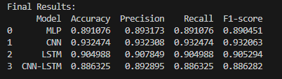

## Observations:

**CNN performs the best overall:**

- Highest Accuracy: 93.25%

- Highest F1-score: 93.21%

- Balanced Precision & Recall (both ~93%), meaning it’s consistently predicting all classes well.

**LSTM is next:**

- Accuracy ~90.5%, slightly better than MLP

- Works well for sequential data, but maybe needs more tuning (layers/units/epochs).

**MLP is solid for a simple feed-forward network:**

- Accuracy ~89%

- Works surprisingly well, considering it doesn’t model temporal dependencies.

**CNN-LSTM hybrid performed worse than expected (~88.6%):**

- Sometimes adding LSTM on top of CNN without proper tuning can actually reduce performance.

- Could be due to overfitting or insufficient epochs, dropout, or LSTM units.

## Analysis / Insights:

- CNN alone is sufficient for this dataset; it can capture spatial patterns in the sensor signals effectively.

- LSTM may need more tuning (units, stacking, learning rate) to outperform CNN.

- Hybrid CNN-LSTM is not guaranteed to improve results — it introduces more parameters and may overfit on a small dataset.

- MLP is the simplest baseline and performs reasonably well.